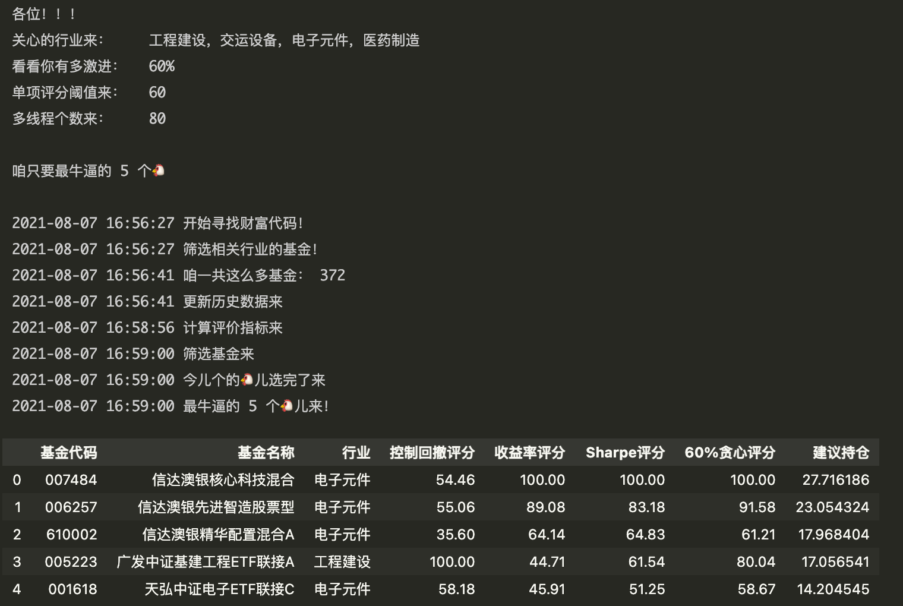

# Chinese-Funds-Scraping-and-Filtering 基金历史数据爬虫与筛选
## ***仅供参考交流之用，盈亏自负。***

基于动量,最大回撤,下行标准差及Sharpe Ratio的简单基金筛选程序，

## Repository contents
* 1_基金主题代码名称对照表.ipynb == 下载基金代码及名称，数据来源:[天天基金网](http://fund.eastmoney.com/daogou/)。
* 2_获取基金历史数据.ipynb == 下载基金历史数据，数据来源[网易财经](http://quotes.money.163.com/fund/jzzs_000039_1.html)
* 3_筛选.py == 根据用户关心的行业类型，激进程度来推荐top N 基金及其推荐持仓比例

### 可选择的行业 

|工程建设|交运设备|农牧饲渔|煤炭采选|食品饮料|电子信息|通讯行业|房地产|
|:-:|:-:|:-:|:-:|:-:|:-:|:-:|:-:|
|**家电行业**|**仪器仪表**|**电子元件**|**医药制造**|**化纤行业**|**券商信托**|**保险**|**银行**|
|**有色金属**|**钢铁行业**|**航天航空**|**汽车行业**|**军工**|**新能源**|**节能环保**|**家电行业**|
|**化工原料**|**稀缺资源**|**新材料**|**转债标的**|**QFII重仓**|**基金重仓**|**材料行业**|**化工行业**|
|**黄金概念**|**生物疫苗**|**机构重仓**|**物联网**|**基本金属**|**股权激励**|**预盈预增**|**云计算**|
|**融资融券**|**央视50**|**中药**|**智慧城市**|**北斗导航**|**土地流转**|**大数据**|**创业成份**|
|**在线教育**|**苹果概念**|**国家安防**|**医疗器械**|**蓝宝石**|**病毒防治**|**燃料电池**|**国企改革**|
|**小金属**|**国产软件**|**充电桩**|**无人机**|**沪股通**|**一带一路**|**5G概念**|**证金持股**|
|**医疗行业**|**环保工程**|**化肥行业**|**贵金属**|**安防设备**|**软件服务**|**金属制品**|**人工智能**|
|**精准医疗**|**大飞机**|**MSCI中国**|**养老金**|**区块链**|**工业互联**|**独角兽**|**OLED**|
|**边缘计算**|**单抗概念**|**标准普尔**|**光刻胶**|**国产芯片**|**无线耳机**|**白酒**|**CRO**|
|**专用设备**|**氮化镓**|**半导体**|**数据中心**|**中芯概念**|**网红直播**|**无线充电**|**航天概念**|
｜**酿酒行业**|**网络游戏**|**生物识别**|**云游戏**|**华为概念**|**深股通**|**海绵城市**|**电子竞技**|
｜**基因测序**|**智能穿戴**|**长江三角**|**机械行业**|**塑胶制品**|

  
### 输出示例

  

